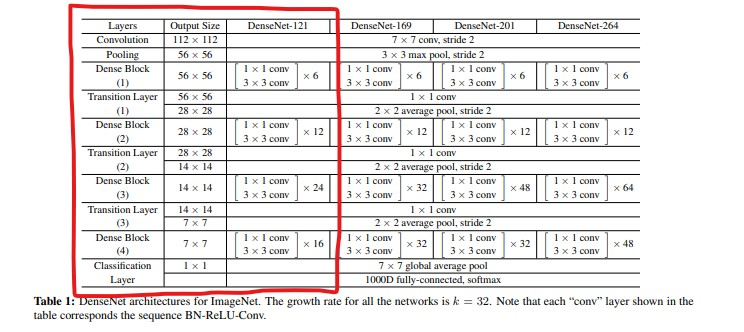

# Densenet121_from_scratch

DenseNet paper link: https://arxiv.org/pdf/1608.06993.pdf
DenseNet (Dense Convolutional Network) is an architecture that focuses on making the deep learning networks go even deeper, but at the same time making them more efficient to train, by using shorter connections between the layers. DenseNet is a convolutional neural network where each layer is connected to all other layers that are deeper in the network, that is, the first layer is connected to the 2nd, 3rd, 4th and so on, the second layer is connected to the 3rd, 4th, 5th and so on. This is done to enable maximum information flow between the layers of the network. To preserve the feed-forward nature, each layer obtains inputs from all the previous layers and passes on its own feature maps to all the layers which will come after it. Unlike Resnets it does not combine features through summation but combines the features by concatenating them. So the ‘ith’ layer has ‘i’ inputs and consists of feature maps of all its preceding convolutional blocks. Its own feature maps are passed on to all the next ‘I-i’ layers. This introduces ‘(I(I+1))/2’ connections in the network, rather than just ‘I’ connections as in traditional deep learning architectures. It hence requires fewer parameters than traditional convolutional neural networks, as there is no need to learn unimportant feature maps.

